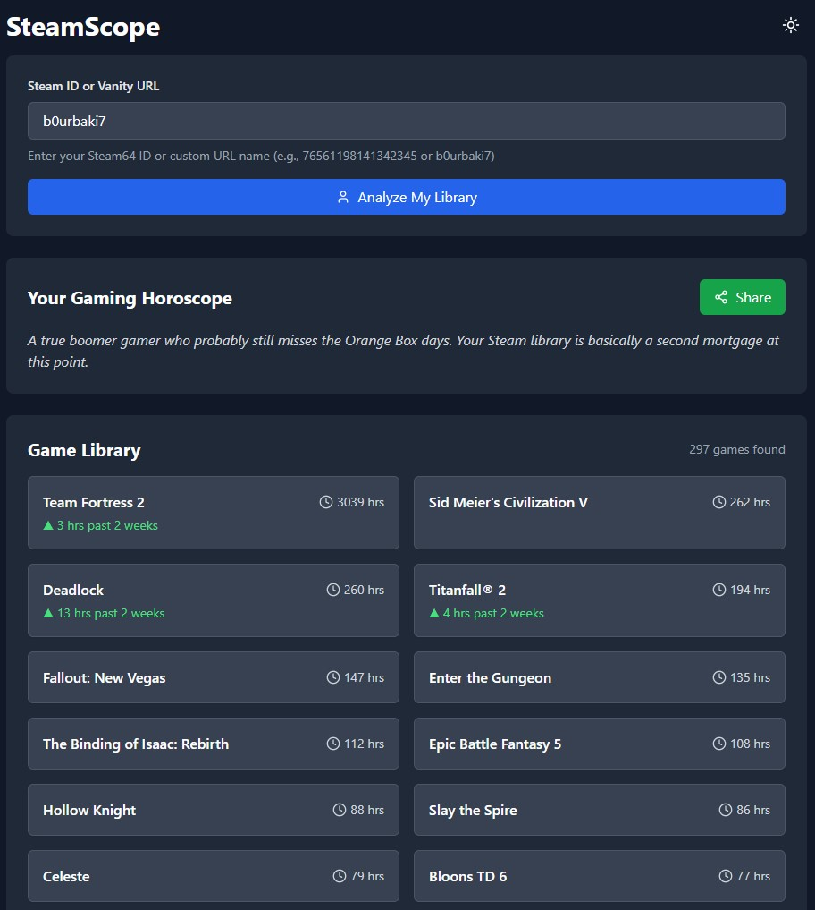

# SteamScope

SteamScope is a fun web application that analyzes a Steam user's game library and generates a personalized "gaming horoscope" based on their play patterns. Just enter your Steam ID or vanity URL and discover what your gaming habits say about you!



## Features

- **Steam Library Analysis**: View your entire Steam library with playtime statistics
- **Personalized Gaming Horoscope**: Get a fun, tongue-in-cheek analysis based on your gaming habits
- **Shareable Images**: Generate customized images to share your gaming profile on social media
- **Dark/Light Mode**: Toggle between light and dark themes

## How to Use

1. Enter your Steam64 ID or custom URL name (e.g., 76561198141342345 or b0urbaki7)
2. Click "Analyze My Library"
3. View your gaming horoscope and library statistics
4. Share your results with the "Share" button
5. Choose your preferred image format
6. Download and share on social media

## Technical Details

- Built with React
- Uses the Steam Web API
- API endpoints:
  - `/api/resolve-vanity`: Resolves a Steam vanity URL to a Steam64 ID
  - `/api/steam-profile`: Fetches a user's Steam profile data
  - `/api/steam-library`: Retrieves a user's game library with playtime statistics
- Deployed on Vercel with GitHub Pages frontend

## Privacy

SteamScope only accesses publicly available Steam profile information. No data is stored or tracked. Your Steam API key is securely stored as an environment variable on the server.

## Local Development

### Prerequisites

- Node.js and npm/yarn
- Steam Web API key

### Setup

1. Clone the repository
```bash
git clone https://github.com/b0urbaki7/steamscope.git
cd steamscope
```

2. Install dependencies
```bash
npm install
# or
yarn install
```

3. Create a `.env` file with your Steam API key
```
STEAM_API_KEY=your_steam_api_key_here
```

4. Start the development server
```bash
npm run dev
# or
yarn dev
```

## Deployment

The application is set up for deployment on Vercel (API) and GitHub Pages (frontend).


## Acknowledgments

- Built with the Steam Web API
- Icons provided by Lucide React
- UI components from ShadcnUI

---

Created by [b0urbaki7](https://github.com/b0urbaki7) - Peek into your gaming soul!